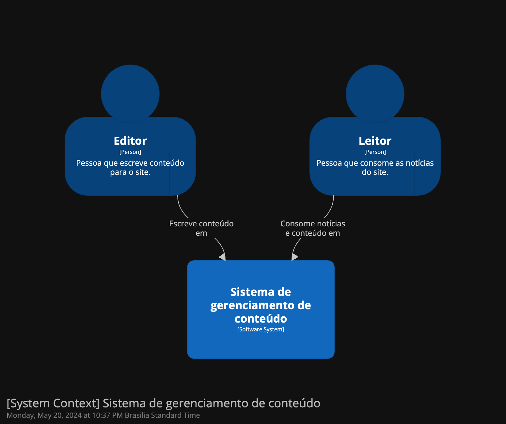
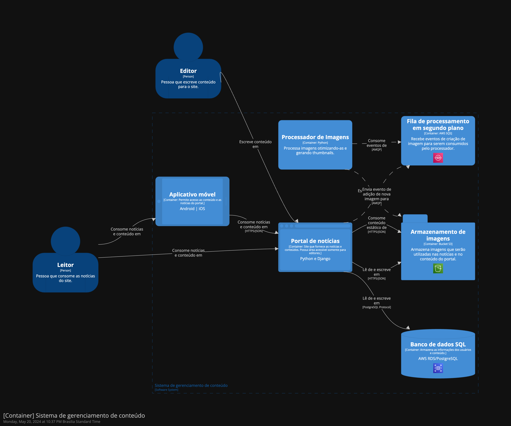

# C4 Model com structurizr

Diagrama feito baseado no vídeo dojo do Cassio Botaro no yt com o objetivo de estudar sobre C4 Model.  
Para gerar o diagrama utilizei a ferramenta structurizr: https://docs.structurizr.com/

Video: https://www.youtube.com/watch?v=gfR8EL0ecpY  
Repositório: https://github.com/cassiobotaro/modeloC4/tree/main

## Diagrama

### SystemContext View

### Container View

Saiba mais sobre C4 Model em: https://c4model.com/
